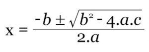

# Exercises

* [Very basic](#very-basic)
* [Easy](#easy)
* [Problems solved by the basics](#problems-solved-by-the-basics)
* [Basic of classes](#basic-of-classes)
* [Under the hood - papper training](#under-the-hood---papper-training)
* [Advanced Problemas](#advanced-problems)
* [Design patterns](#design-patterns)
* [Regular expressions](#regular-expressions)
* [Specifics ones](#specific-ones)
* [Algorithms](#algorithms)

## Very basic

1. Write a loop that prints `hello` ten times.

2. Prints numbers from 1 to 12.

3. Prints even numbers from 2 to 24.

4. Writes a script that receives a number as command line argument and sum all numbers from 1 until the given number and prints the result as a script output.

## Easy

1. Writes a script that receives a number as command line argument and sum all numbers from 1 until the given number. Also, sum all even values. Them, as a scrip output, writes the sum from all numbers, and the sum of all even numbers as well.

2. Can you find a problem in the following perl script?

**Worth to say**: The `next` statement means that the loop block should be interrupted in the current iteration and continues to the next iteration.

```perl
$count = 0;
while ($count <= 10) {
    if ($count == 5) {
        next;
    }
    $count++;
}
```

3. Writes a script that keeps continually receiving a phrase from the user in the command line or that receives data from an file content through redirection, and as output for each line is the word's number from the phrase.

4. Write a function that takes an array with a even count, then breaks the array in the half, extracting other two arrays, one with the first half of the values and another with the second half of the values.

5. Creates a relational database as beign a business data schema:

* Register an employee.
* Register a department.
* A department must be managed by *just s single employee*.
* Several employees can belogns to a single department.
* An employee can work on several projects at once.
* Register a project.
* An employee can have none, one or several projects.
* Department can control several projects. A department can exists without an project.
* If a project exists, it MUST HAVE a department.
* A project must have a unique number.
* A project also MUST NOT exists without an eployee.
* An emplyee can supervisor another employee.

## Problems solved by the basics

1. Write a program that prints every number from 0 to 1 that has a single digit after the decimal place (that is, 0.1, 0.2 and so on).

2. Writes a program that receives a numeric argument and checks its value. If the value is greater than the 17, them prints "`Currently, is in adulthood and can take on responsabilities`". Otherwise, prints "`Depends upon adult, not allowed to take serious chooses`". Or something like that.

3. Creates a *virtual dice*. Each time you use it, a random number between 1 and 6 are given.

4. Create *virtual dices* for D&D. This game also needs dices with different amount of sides, which are 4, 8, 10, 12 and 20 sides. Create a function for each case.

5. Create a *variable dice*. Suppose that you will always requires throw dices with diffenrent sides. Create a single function that allows you to have random numbers from 1 until 6, 4, 8, 10, 12, 20, 7, 66, 102, 1005, or whichever the user wants.

6. Creates a function that tells an *amount of oranges that you have*. For example: if a have no oranges, then prints "I have no organges.". If I have one orange, them prints "I have one orange". If have 2 or more oranges, them prints "I have several oranges".

## Basic of classes

1. Write a class called `Person`. The class must have it's height and weight as a property. Also, a property called name (helding the person name) to facilitates the person identification. Then, in the class itself also must have a method that calculates the BMI, call this method as `getMbi`. And finally, write another method called `condition`, that just prints a *person condition*, stating that the person is *thin*, *normal* or *overweight*, based on the data in https://www.diabetes.ca/managing-my-diabetes/tools---resources/body-mass-index-(bmi)-calculator. 

## Under the hood - papper training

1. Convert the following numbers to binary.

* 99
* 124
* 155
* 144
* 391
* 207
* 727
* 436
* 830
* 650
* 370
* 226
* 95

2. What is the result of the following expressions? Considers to store number in with 16 bits when necessary.

* a. `222 << 2`
* b. `56 & 33`
* c. `534 >> 1`
* d. `765 | 34`
* e. `224 ^ 401`
* f. `~198` (this one, you can provide the answer in binary)

## Advanced problems

1. We got the following contry - sequence pair, with 12 contries:

* Eritrea - 465
* Kazakhstan - 646
* Philippines - 385
* Saudi Arabia - 391
* Palau - 416
* Northern Cyprus - 130
* United Arab Emirates - 348
* Cuba - 101
* Cyprus - 561
* Zimbabwe - 518
* Tanzania - 513
* Brunei - 91

Rewrite the sequence number for all conutries, starting from 1, followed by its exact following number, obeying exact same sequence dicted by the original sequence number.

For example, you have:

* CountryA - 49
* CountryB - 79
* CountryC - 7
* CountryD - 43

Then rewrite:

* CountryA - 3
* CountryB - 4
* CountryC - 1
* CountryD - 2

So, sorting the sequence obeying the new sequence, you will get:

* CountryC - 1
* CountryD - 2
* CountryA - 3
* CountryB - 4

Observation: good if you write your own algorithm to reorder instead of using a high level function from some language. If you want to do so first, ok. But after create your own algorithm to reorder.

2. *The RPG character maker*

All participants from a RPG game plays as a specific character. Any character have a set of abilities, and all of those abilities have a score representing the mastery of the character on the specific abilities.

All character have the following abilities:

* Strength
* Dexterity
* Constitution
* Intelligence
* Wisdom
* Charisma
* Comeliness
* Endurance
* Education
* Vitality
* Willpower
* Quickness

Thus, 12 abilities.

Lets start a RPG game. And at the beggining, the participants must assign abilities scores to the character to which he or she will play. Each participant will have an amount of score to distribute across each ability. This initial score is assigned to an *luck factor*. To determine its initial score to distribute, the participant must throw a dice of 4 twelven times and sum the results for each throw. Having its initial score, he can distribute the points across the twelve abilities as he wants. He must assign at least 1 to each score. Assign 0 is not alowed. But there's no score limit to assign to each ability, as long the sum of all abilities does not overflow the initial score.

Lets write a program that:

a) Generates the initial score to distribute across all abilities.

This means that the results from this calculations must simulates a participant throwing a dice of four twenve times.

b) Automatically and randomly assign the ability scores to each of twelve abilities

This means that the sum of all twelve abilities must match the initial score give.

# Design Patterns

1. Check the following module:

Pattern.py
```py
from src.FormatString import FormatString
from src.FormatNumber import FormatNumber

class Pattern:

    @staticmethod
    def doing(type: str):
        
        if type == "number":
            return FormatNumber()
        elif type == "string":
            return FormatString()
        raise ValueError("Unknown format given")
```

FormatterInterface.py
```py
import abc

class FormatterInterface(abc.ABC):

    @staticmethod
    @abc.abstractmethod
    def format(input: str) -> str:
        pass    
```

FormatString.py
```py
from src.FormatterInterface import FormatterInterface

class FormatString(FormatterInterface):

    @staticmethod
    def format(input: str) -> str:
        return input
```

FormatNumber.py
```py
from src.FormatterInterface import FormatterInterface

class FormatNumber(FormatterInterface):

    @staticmethod
    def format(input: str) -> str:
        return str(round(float(input), 0))

```
Which is the name of the pattern, considering the patterns of GOF? In which category does the pattern falls?

## Regular Expressions

1. Given the regex:

`/de+f/`

What patterns matches successfully (more than one option may be correct)?

1) `def`
2) `deff`
3) `deeeef`
4) `deffff`
5) `de`

2. Which is the difference between `*`, `?` and `+`?

3. Which is the word boundary pattern anchor?

4. What `\d` means?

5. What `\s` means?

6. What is the difference between `d.*f` and `d.+f`?

7. I want to type a regular expression thats matches both a single new line and a empty entrance. Wich one is the correct answer?

* a) `/[\n|]/`
* b) `/(\n|)/`

8. What means the following pattern:

* `[^0-9]`

9. What means the following pattern:

* `[\d]{4}`

10. What means the following pattern:

* `^[^\d{4}-\d{2}-\d{2}]`

11. Write a regex that finds all following words at once:

```
bar ber bir bor bur
```

12. What does this regex does?
```
s/[^aeiou]//g
```

13. Whats is the difference of the following regex?

* a) `s/<.*>//g`

* b) `s/<.>//g`

* c) `s/<.*?>//g`

## Specific ones

In what language this array value assigment is valid?

```
$vowelcount{$vowel} += 1;
```

## Algorithms

1. Check the following code:
```
void printBinary(unsigned int num) {
    if (num > 1) {
        printBinary(num / 2);
    }
    printf("%d", num % 2);
}
```

1.1 Can you tell what the code does?

1.2 Can you tell in which language it is written?

2. Write an algorithm to solve the second degree equation. Just to rememeber, a second degree equation can be in the form of (a)x<sup>2</sup> + (b)x + c = 0. The Bhaskara equation is:


